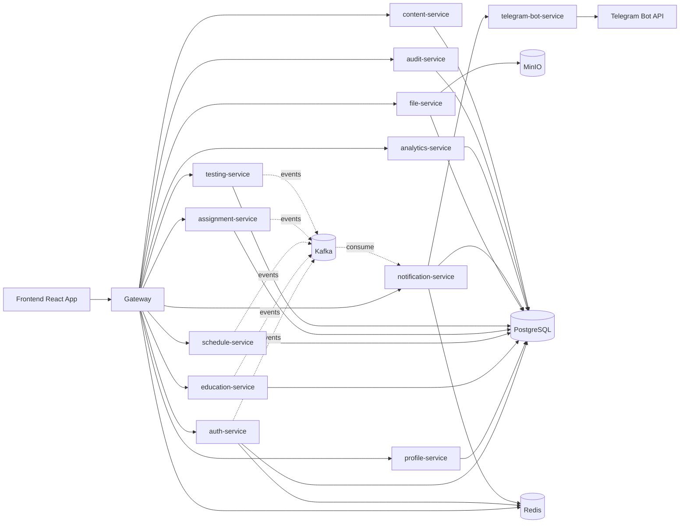
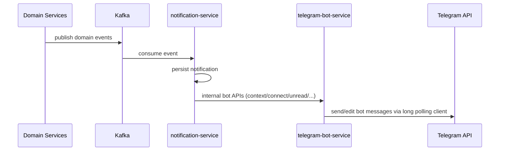

# Studium Architecture

## Overview
Studium is a microservice LMS with a single public gateway and a React frontend. Services are isolated by schema/database ownership and communicate through REST (sync) and Kafka events (async).

## Core Architecture Rules in Practice
- Public access enters only through `gateway`.
- Service-to-service authorization uses internal shared secrets where applicable.
- Services own their own data schema; no direct cross-service DB reads are used for business flows.
- Domain event publication is used for cross-cutting notifications and derived processing.

## Gateway Role
`gateway` provides:
- route-based access control and role checks
- CORS/policy enforcement
- BFF endpoints (for example, dashboard and personal schedule aggregations)
- a single API origin for frontend

## Service Responsibilities (High Level)
- `auth-service`: identity, login/register/MFA, role admin, user ban flows
- `profile-service`: user profile and avatar references
- `education-service`: groups, subjects, topics, specialties/streams/curriculum plans, roster structure
- `schedule-service`: schedule templates, overrides, read/search/export
- `assignment-service`: assignments, submissions, grades, attachment policy enforcement
- `testing-service`: tests/questions/answers, attempts, result review
- `file-service`: file storage metadata + MinIO integration + preview/download
- `notification-service`: in-app notifications, realtime fanout, Telegram link source-of-truth
- `telegram-bot-service`: Telegram long-polling UI client over internal notification APIs
- `analytics-service`: dashboard/analytics projections
- `audit-service`: audit trails
- `content-service`: course content module surface

## Security Model
- JWT bearer tokens across public API
- role model used in both backend and frontend routing
- internal APIs protected with internal shared secret headers

## Role-Based Access Model (Summary)
- Student: learning consumption, submissions/tests, own profile/notifications/group
- Teacher: subject-bound instructional workflows and review queues
- Admin/Owner: platform and academic management (rooms, structure, users, schedule management)

Detailed matrix: [roles-permissions.md](roles-permissions.md)

## File Handling Flow
1. Frontend uploads through gateway to `file-service`.
2. `file-service` stores metadata in PostgreSQL and binary payload in MinIO.
3. Business services reference `fileId` and enforce access rules.
4. Preview/download is resolved by file-service policies (PDF/image preview support).

## Notification + Telegram Flow

## Telegram Architecture Notes
- Separate service (`telegram-bot-service`) with official TelegramBots long polling starter.
- No webhook mode is used.
- Bot startup validates token and disables polling safely when invalid/missing.

Details: [telegram-bot.md](telegram-bot.md)
