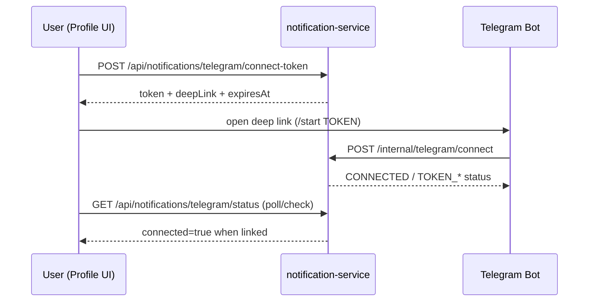

# Telegram Bot Integration

## Why Separate Service
`telegram-bot-service` is a standalone microservice to keep Telegram transport/runtime concerns isolated from notification persistence and core LMS business services.

`notification-service` remains source-of-truth for:
- Telegram links
- connect tokens
- Telegram preferences
- unread notification data for bot UI
- admin bot-user operations and stats

## Runtime Model
- Library: official `telegrambots-springboot-longpolling-starter` + `telegrambots-client`
- Transport: long polling only
- Webhook: not used

## Startup Behavior and Token Validation
Startup uses a runtime inspector that:
- checks `TELEGRAM_ENABLED`
- validates token format
- calls Telegram `getMe` for validity checks
- sets runtime token validation status

If token is missing/placeholder/invalid/unauthorized/not found:
- service still starts
- polling is disabled
- warning diagnostics are logged

No secret/token value is logged.

## Bot Routing Architecture
Inspired by xSaoBot-style annotation routing.

Implemented components:
- `TelegramUpdateFacade` routes update type
- `CommandRouter` scans `@BotCommandHandler` + `@BotCommand`
- `CallbackRouter` scans `@BotCallbackController` + `@BotCallback`
- callback route variables via `@CallbackPathVariable`

Example route patterns:
- command: `/start`, `/menu`, `/status`, `/help`, `/disconnect`
- callback: `schedule:day:{date}`, `settings:toggle:{category}`, `admin:disable:{linkId}`

## UX Model
Bot screens are rendered via a screen abstraction and response service with edit-first behavior.

Implemented behavior:
- callback navigation tries to edit existing bot message
- send-new fallback on edit failure
- inline keyboard callback menu flow
- generated banner/schedule image support

## Image Generation and Cache
- `BotImageRenderer` + `DefaultBotImageRenderer` generate PNGs in memory
- `BotImageCache` stores image entries with TTL eviction
- keys include user/context dimensions to avoid cross-user data leakage

## Account Linking Flow

## `/start TOKEN` Behavior
Current bot flow includes localized responses for:
- connected
- already connected
- token invalid/expired/used/revoked
- linked to another account
- user already has another link

`/start` without token points user to connect from Studium profile.

## Local URL Limitation
Telegram inline keyboard URL buttons require publicly valid URLs.

Current policy rejects local/internal URLs for bot URL buttons (for example `localhost`, `127.0.0.1`).
When invalid, bot uses safe fallback callback instructions instead of sending broken URL buttons.

## Admin/Owner Bot Management
Bot includes admin callback screens backed by notification-service internal admin APIs:
- bot user listing
- bot stats
- disable/enable link
- send test to linked user

## Current Known Limitation
`notification-service` `InternalTelegramBotService.scheduleDay(...)` currently returns placeholder empty schedule data because a schedule internal contract for Telegram context is not wired yet.

Practical effect:
- schedule image/menu screen works structurally
- lesson payload is empty-state until internal schedule integration is implemented
